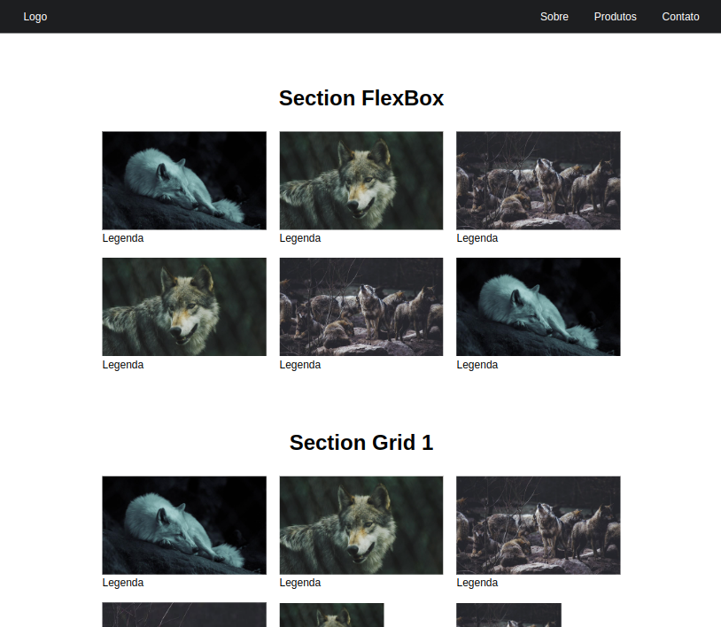

<!-- <h1 align="center">
  
</h1> -->

  <a href="#-projeto">Projeto</a>&nbsp;&nbsp;&nbsp;|&nbsp;&nbsp;&nbsp;
  <a href="#-tecnologias">Tecnologias</a>
 

 

<h2 align="center"></h2>

 

<!-- 

  

 -->

 

## 💻 Projeto

FlexBox-CSS-Grid é nada menos que um exercício prático de FlexBox e CSS Grid Layout, do qual um video no YouTube ensina as práticas de cada tecnologia e também disponibiliza o layout no Figma para testes...

 

## ✨ Tecnologias

Esse projeto foi desenvolvido com as seguintes tecnologias:

- HTML
- CSS
  - Flexbox
  - CSS Grid Layout

---
